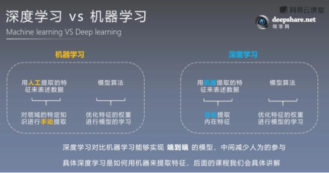
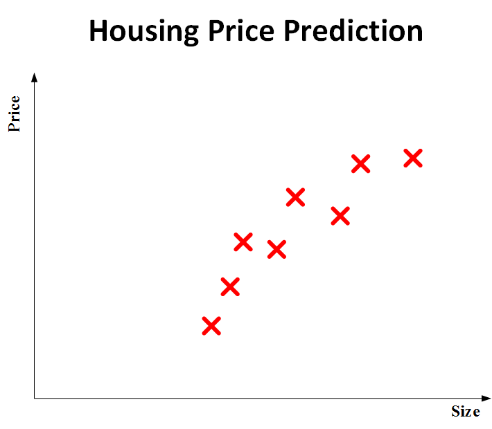
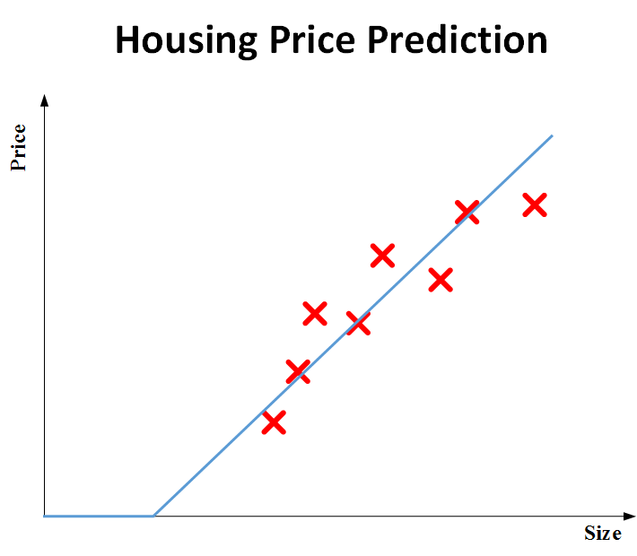
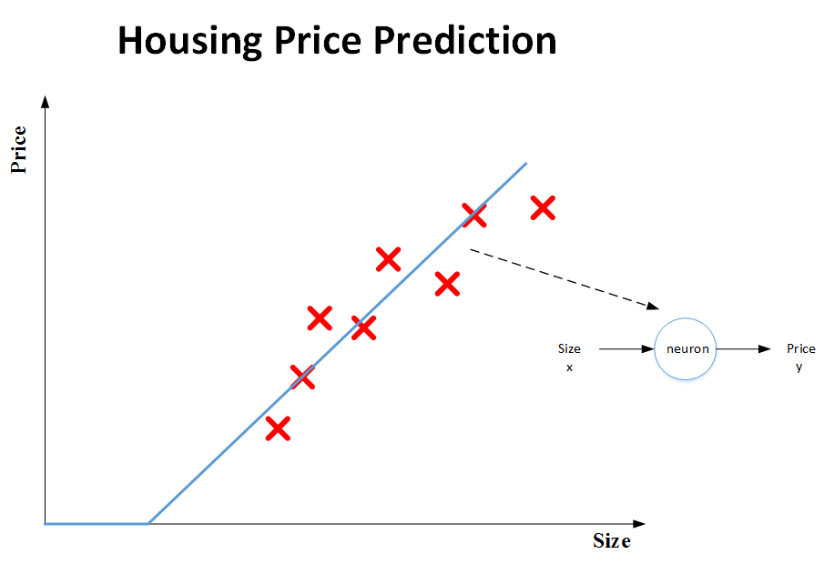
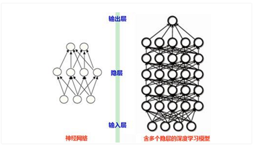
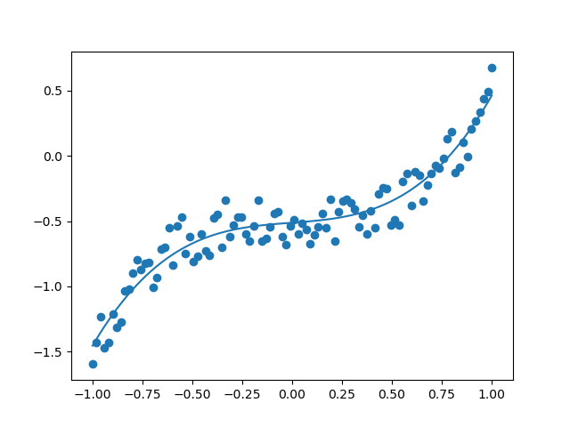
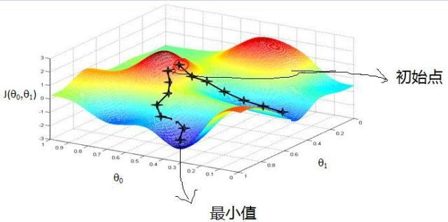
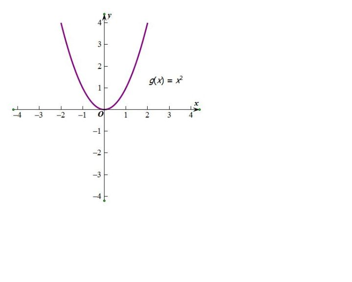
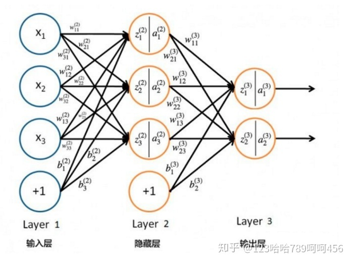

---
presentation:
    theme: simple.css
    enableSpeakerNotes: true
    mouseWheel: true
    width: 1080
    height: 720
---

<!-- slide -->

## 极客寒假学习报告
### &emsp;&emsp;&emsp;&emsp;&emsp;&emsp;&emsp;&emsp;&emsp;&emsp;&emsp;——深度学习
####&emsp;&emsp;&emsp;&emsp;&emsp;&emsp;&emsp;&emsp;&emsp;&emsp;&emsp;&emsp;&emsp;&emsp;&emsp;&emsp;&emsp;&emsp;&emsp;&emsp;李之昊

<!-- slide -->

##什么是深度学习？

<!-- slide -->
###深度学习：一种实现机器学习的技术
<!-- slide -->
###机器学习：一种实现人工智能的方法
<!-- slide -->
@import "img/1.jpg" 

<!-- slide -->

<!-- slide -->

##什么是神经网络？

<!-- slide -->

神经网络简单点将就是由许多个神经元组成的系统。

<!-- slide -->

<!-- slide vertical=true -->

<!-- slide vertical=true -->

<!-- slide -->
深度学习是为了让层数较多的多层神经网络可以训练
能够运行起来而演化出来的一系列的新的结构和新的方法

<!-- slide -->

###深度学习等于多层神经网络
###但不只是多层神经网络

<!-- slide data-notes="卷积神经网络CNN，在原来多层神经网络的基础上，加入了更加有效的特征学习部分" -->

<!-- slide -->

<!-- slide -->

## $$Loss \ function$$

<!-- slide -->
###平方误差（squared error）
$$
L(\hat{y},y)=\frac{1}{2}(y-\hat{y})^2
$$

<!-- slide vertical=true -->
$$
L(\hat{y},y)=−(ylog\hat{y}+(1−y)log(1−\hat{y}))
$$
<!-- slide -->
## $$Cost \ function$$
<!-- slide -->
$$J = \frac{1}{m}\sum_{i=1}^m L(\hat{y}^{(i)},y^{(i)})$$
<!-- slide vertical=true -->
$$J(y , \hat{y}) = \frac{1}{2m}\sum_{i=1}^m(y-\hat{y})^2$$
<!-- slide -->
##梯度下降

<!-- slide -->
- 在单变量的函数中，梯度其实就是函数的微分，代表着函数在某个给定点的切线的斜率
- 在多变量函数中，梯度是一个向量，向量有方向，梯度的方向就指出了函数在给定点的上升最快的方向

<!-- slide -->

$$
\theta_{i}:=\theta_{i}-\alpha\frac{\partial J(\theta)}{\partial \theta_{i}}
$$

<!-- slide -->

<!-- slide -->
### $$z=wx+b$$
### $$y=g(z)$$
<!-- slide vertical=true -->
$$
Sigmoid(Z)=\frac{1}{1+e^{-z}}
$$
<!-- slide vertical=true -->

<!-- slide vertical=true -->
激活函数向神经网络中引入非线性因素
通过激活函数，神经网络就可以拟合各种曲线

<!-- slide -->
##前向传播
<!-- slide 
data-notes="将上一层的输出作为下一层的输入，并计算下一层的输出，一直到运算到输出层为止。" -->

<!-- slide -->
##反向传播
<!-- slide -->
###链式法则
>如果某个函数由复合函数表示
则该复合函数的导数可以用构成复合函数的各个函数的导数的乘积表示。
<!-- slide -->

<!-- slide -->
1. 通过前向传播，由输入层传递信息至输出层，得到最终输出
2. 通过反向传播，从输出层传回至输入层，修改参数、优化模型。
3. 重复前两步，使 $J(\theta)$尽可能的小
<!-- slide -->
#谢谢观看